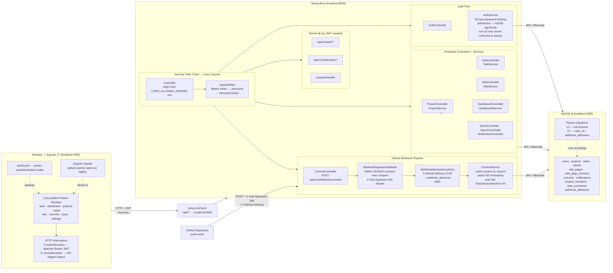

# DevSync — Developer Explainer

How every layer connects, what fires in what order, and where your data goes.

---

## Architecture Data Flow



---

## Sequence Diagram — Three Critical Flows

```mermaid
sequenceDiagram
    actor Dev as Developer

    participant NG   as Angular App
    participant INT  as authInterceptor
    participant PX   as Dev Proxy
    participant JWF  as JwtAuthFilter
    participant CTR  as Controller
    participant SVC  as Service
    participant JPA  as JPA / Hibernate
    participant DB   as MySQL

    participant GH   as GitHub
    participant WC   as CommitController
    participant SIG  as WebhookSignatureValidator
    participant IDS  as WebhookIdempotencyStore
    participant CS   as CommitService

    %% ════════════════════════════════════════════════════════════════════
    Note over Dev,DB: ── FLOW 1 · Login ──────────────────────────────────

    Dev->>NG: submit email + password
    NG->>PX: POST /api/v1/auth/login (no token yet)
    PX->>JWF: forward request
    Note over JWF: no Authorization header → skips JWT logic
    JWF->>CTR: AuthController.login()
    CTR->>SVC: AuthService.login(email, password)
    SVC->>DB: SELECT user WHERE email = ?
    DB-->>SVC: User row (passwordHash)
    SVC->>SVC: BCrypt.matches(password, hash) ✓
    SVC->>SVC: JwtService.generateToken(user) → HS256 JWT (24 h)
    SVC-->>CTR: AuthResponse { token, user }
    CTR-->>NG: 200 { token, user }
    NG->>NG: AuthService.token.set(jwt)\nAuthService.currentUser.set(user)\nlocalStorage.setItem token
    NG->>Dev: navigate to /dashboard

    %% ════════════════════════════════════════════════════════════════════
    Note over Dev,DB: ── FLOW 2 · JWT-protected API call (e.g. move task on kanban) ──

    Dev->>NG: drag task card to IN_REVIEW column
    NG->>INT: HttpClient.patch('/api/v1/projects/3/tasks/42/status')
    Note over INT: authInterceptor fires — token exists
    INT->>INT: clone request, add "Authorization: Bearer <jwt>"
    INT->>PX: PATCH /api/v1/projects/3/tasks/42/status
    PX->>JWF: forward request
    JWF->>JWF: extract JWT from Authorization header
    JWF->>DB: UserDetailsService.loadByUsername(email)
    DB-->>JWF: UserDetails (roles, enabled)
    JWF->>JWF: JwtService.isTokenValid(jwt, userDetails) ✓
    JWF->>JWF: set SecurityContext with authenticated principal
    JWF->>CTR: TaskController.updateStatus(projectId=3, taskId=42)
    CTR->>SVC: TaskService.updateStatus(42, "IN_REVIEW")
    SVC->>JPA: task.setStatus(IN_REVIEW); save(task)
    JPA->>DB: UPDATE tasks SET status='IN_REVIEW', updated_at=now() WHERE id=42
    DB-->>SVC: updated Task entity
    SVC-->>CTR: TaskDto
    CTR-->>NG: 200 ApiResponse { data: TaskDto }
    NG->>NG: update kanban signal → UI re-renders automatically

    %% ════════════════════════════════════════════════════════════════════
    Note over GH,DB: ── FLOW 3 · GitHub push webhook → commit auto-link ──

    Dev->>GH: git push (commit message: "fixes #42 — fix NPE in TaskService")
    GH->>WC: POST /api/v1/webhooks/commits\nX-Hub-Signature-256: sha256=<hmac>\nX-GitHub-Event: push\nX-GitHub-Delivery: d4e5f6-uuid
    Note over WC: SecurityConfig permits /webhooks/** without JWT

    WC->>SIG: isValid(signature, rawBody)
    SIG->>SIG: HMAC-SHA256(body, GITHUB_WEBHOOK_SECRET)\nMessageDigest.isEqual() — constant time
    SIG-->>WC: true ✓

    WC->>WC: X-GitHub-Event == "push" ✓

    WC->>IDS: alreadyProcessed("d4e5f6-uuid")
    IDS->>DB: SELECT 1 FROM webhook_deliveries WHERE delivery_id = ?
    DB-->>IDS: empty (first time)
    IDS-->>WC: false — proceed

    WC->>CS: processWebhook("d4e5f6-uuid", payload)

    CS->>CS: parse repository.html_url from payload
    CS->>DB: SELECT * FROM projects (all rows)
    DB-->>CS: [Project{repoUrl: "https://github.com/org/repo"}, ...]
    CS->>CS: match project whose repoUrl == payload.repository.html_url ✓ Project #3

    loop for each commit in payload.commits[]
        CS->>DB: existsByCommitHash(hash)? → false
        CS->>CS: parse author.name, author.email, timestamp (ISO-8601 → LocalDateTime)
        CS->>CS: TASK_REF regex → finds "fixes #42" → taskId = 42
        CS->>DB: SELECT task WHERE id=42 AND project_id=3
        DB-->>CS: Task entity ✓
        CS->>CS: commit.setLinkedTask(task)
        CS->>JPA: commitRepo.save(commit)
        JPA->>DB: INSERT INTO commits (hash, message, author_name, linked_task_id, ...) VALUES (...)
    end

    CS->>IDS: markProcessed("d4e5f6-uuid")
    IDS->>DB: INSERT INTO webhook_deliveries (delivery_id) VALUES (?)

    WC-->>GH: 200 OK (GitHub marks delivery successful)

    Note over GH,DB: Next time Dev visits /commits in the app,\ncommit appears with #42 badge linked to the task.
```

---

## Layer-by-layer Reference

### Frontend — what lives where

```
src/app/
├── core/
│   ├── services/
│   │   ├── auth.service.ts        token Signal, currentUser Signal, login/logout
│   │   ├── api.service.ts         generic get/post/patch/delete — unwraps ApiResponse<T>
│   │   ├── project.service.ts     getAll, getById, create, update, getMembers, addMember
│   │   └── task.service.ts        getTasks, getKanban, updateStatus, addComment
│   ├── interceptors/
│   │   ├── auth.interceptor.ts    clones every request + adds Bearer header
│   │   └── error.interceptor.ts   catches 401 → AuthService.logout() + redirect
│   └── guards/
│       └── auth.guard.ts          checks auth.isAuthenticated() — returns /auth/login if false
│
├── layout/
│   ├── main-layout/               shell: sidebar + topbar + <router-outlet>
│   ├── sidebar/                   navigation links (routerLink), active route highlighting
│   └── topbar/                    search bar, notification bell, user avatar menu
│
└── modules/
    ├── auth/                      reactive forms, passwordMatchValidator, BCrypt on backend
    ├── dashboard/                 4 stat cards, Timeline (activity), DataTable (my tasks)
    ├── projects/                  DataView grid, create dialog, detail tabs
    ├── tasks/                     CDK DragDrop kanban (5 columns), task-form Dialog
    ├── wiki/                      split-pane editor, marked v12 renderer, mermaid.js,
    │                              confluence-parser (3-pass macro converter), TOC sidebar
    ├── commits/                   commits table, Link Task dialog, webhook setup banner
    ├── team/                      member cards, invite dialog (email + role)
    └── settings/                  TabView: Profile · Security · Notifications · API Keys
```

### Backend — request lifecycle

```
Incoming request
    │
    ├─ CORS preflight?  →  CorsFilter responds with Allow headers (no further processing)
    │
    ├─ /auth/** or /webhooks/** or /actuator/health
    │       └─ JwtAuthFilter skips (no Authorization header required)
    │
    └─ Everything else
            └─ JwtAuthFilter
                    ├─ missing/bad header    → passes through unauthenticated
                    ├─ expired token         → passes through unauthenticated → 401 from controller
                    └─ valid token
                            └─ SecurityContext.setAuthentication(principal)
                                    └─ @PreAuthorize on controller method
                                            └─ Service → JPA → MySQL
```

### Webhook — what each guard does

```
POST /api/v1/webhooks/commits
    │
    ├─ WebhookSignatureValidator.isValid()
    │       Computes  HMAC-SHA256(rawBody, GITHUB_WEBHOOK_SECRET)
    │       Compares  "sha256=<computed>"  vs  X-Hub-Signature-256 header
    │       Uses      MessageDigest.isEqual()  ← constant-time, not String.equals()
    │       Returns   401 if mismatch
    │
    ├─ X-GitHub-Event check
    │       "push"  →  continue
    │       anything else (ping, PR, issues…)  →  200 silently
    │
    ├─ WebhookIdempotencyStore.alreadyProcessed(deliveryId)
    │       SELECT 1 FROM webhook_deliveries WHERE delivery_id = X-GitHub-Delivery UUID
    │       If found  →  200 silently  (GitHub retried a delivery we already handled)
    │
    └─ CommitService.processWebhook()
            Parse  repository.html_url
            Find   project WHERE project.repoUrl = html_url
            For each commit:
                Skip  if commitHash already in DB  (second idempotency layer)
                Parse ISO-8601 timestamp  (not LocalDateTime.now())
                Regex "(?:fix(?:e[sd])?|close[sd]?|resolve[sd]?)?\s*#(\d+)"
                      matches: #42  fixes #42  closes #42  resolves #42
                Auto-link Task if same project
                INSERT commit row
            INSERT webhook_deliveries row  (marks delivery done)
```

### Database — table ownership

```
Table                 Owner entity          Notes
─────────────────     ─────────────────     ───────────────────────────────────────────
users                 User                  extends BaseEntity (id, createdAt, updatedAt,
projects              Project                 isDeleted, version for optimistic lock)
tasks                 Task
sprints               Sprint
wiki_pages            WikiPage
wiki_page_versions    WikiPageVersion       does NOT extend BaseEntity (separate id/ts)
commits               Commit                does NOT extend BaseEntity
notifications         Notification          does NOT extend BaseEntity
project_members       ProjectMember         does NOT extend BaseEntity
task_comments         TaskComment           does NOT extend BaseEntity
webhook_deliveries    WebhookDelivery       V2 migration — idempotency store
```

All entities that extend BaseEntity carry `@Where(clause="is_deleted=0")` — soft deletes
are invisible to all JPA queries automatically.

Flyway runs on every startup:
- V1 — creates the entire schema
- V2 — adds `repo_url` to `projects`, creates `webhook_deliveries`

### Environment variables — full list

```
Variable                  Default (dev)                    Purpose
──────────────────────    ─────────────────────────────    ────────────────────────────────────
JWT_SECRET                devapp-super-secret-key-…        HS256 signing key (min 32 chars)
GITHUB_WEBHOOK_SECRET     (empty — validation skipped)     GitHub webhook HMAC secret
CORS_ALLOWED_ORIGINS      http://localhost:4300            Comma-separated allowed origins
MYSQL_USER                devapp                           App DB user (least privilege)
MYSQL_PASSWORD            devapp_pass                      App DB password
MYSQL_ROOT_USER           root                             Flyway migration user
MYSQL_ROOT_PASSWORD       root                             Flyway migration password
```

### Commit auto-linking — keyword reference

Patterns recognised in commit messages (case-insensitive):

```
Pattern                      Example commit message
──────────────────────────   ──────────────────────────────────────────────────────
#<id>                        #42 bump version
fix #<id>                    fix #42
fixes #<id>                  fixes #42
fixed #<id>                  fixed #42
close #<id>                  close #42
closes #<id>                 closes #42
closed #<id>                 closed #42
resolve #<id>                resolve #42
resolves #<id>               resolves #42
resolved #<id>               resolved #42
```

Only the first matching reference is used. Task must belong to the same project
as the one matched by `project.repoUrl`.
