# MASTER PROMPT v2 — Full Stack + Infra + Best Practices
## (Updated: added Solution Architect + Developer + Design + Security layers)
## DevSync: Angular + PrimeNG + Spring Boot + MySQL + Keycloak + Apiman + Docker + Kubernetes

---

## Complete Infrastructure Stack (All Open Source)

```
┌──────────────────────────────────────────────────────────────────────────┐
│                         KUBERNETES CLUSTER                               │
│  namespace: devapp                                                        │
│                                                                          │
│  ┌─────────────┐    ┌─────────────────────────────────────────────────┐ │
│  │  Ingress    │    │              Application Tier                    │ │
│  │  nginx +    │───►│                                                  │ │
│  │  cert-mgr   │    │  ┌──────────┐ ┌─────────┐ ┌──────┐ ┌────────┐ │ │
│  └─────────────┘    │  │frontend  │ │backend  │ │apiman│ │keycloak│ │ │
│                     │  │Angular17 │ │Spring   │ │API   │ │OIDC/   │ │ │
│  ┌─────────────┐    │  │PrimeNG   │ │Boot 3   │ │GW+   │ │SSO     │ │ │
│  │   HPA       │    │  │nginx     │ │Java 21  │ │Mgmt  │ │24.0    │ │ │
│  │ cpu>70%     │    │  └──────────┘ └────┬────┘ └──┬───┘ └───┬────┘ │ │
│  │ → scale     │    │                    │          │         │      │ │
│  └─────────────┘    │  ┌─────────────────▼──────────▼─────────▼────┐ │ │
│                     │  │                  MySQL 8                   │ │ │
│                     │  │   devapp DB  |  keycloak DB  |  apiman DB  │ │ │
│                     │  │        (StatefulSet + PVC)                 │ │ │
│                     │  └────────────────────────────────────────────┘ │ │
│                     └─────────────────────────────────────────────────┘ │
└──────────────────────────────────────────────────────────────────────────┘

Local Dev (Docker Compose): same services, ports exposed directly
```

---

## Full Technology Registry

| Component | Technology | Version | License | Port |
|-----------|-----------|---------|---------|------|
| Frontend | Angular + PrimeNG | 17 / 17.18 | MIT | 4200 / 80 |
| Backend | Spring Boot | 3.2 | Apache 2 | 8080 |
| Runtime | Java | 21 (Eclipse Temurin) | GPL+CE | — |
| Database | MySQL | 8.0 | GPL 2 | 3306 |
| Identity | Keycloak | 24.0 | Apache 2 | 8180 |
| API Gateway | Apiman | 3.1.0.Final | Apache 2 | 8280/8290 |
| Container Runtime | Docker | 25+ | Apache 2 | — |
| Orchestration | Kubernetes | 1.29+ | Apache 2 | — |
| Ingress | ingress-nginx | 1.10 | Apache 2 | 80/443 |
| TLS | cert-manager | 1.14 | Apache 2 | — |
| Migrations | Flyway | 10 | Apache 2 | — |
| Wiki markup | vonfluence-wiki-markdown-chalks | custom | — | — |
| MD Previewer | markdown-previewer-mermaid | custom | — | — |
| Diagrams | Mermaid.js | 11.4 | MIT | — |

---

## COMPLETE MASTER GENERATION PROMPT

```
You are a senior full-stack + DevOps engineer. Build the complete production-ready 
"DevSync" project management platform with full infrastructure.

═══════════════════════════════════════════════════════════════
APPLICATION LAYER (from v1 prompt — keep all of this)
═══════════════════════════════════════════════════════════════

TECH STACK:
  Frontend:   Angular 17 standalone, PrimeNG 17, PrimeFlex, npm
  Backend:    Java 21, Spring Boot 3.2, Maven
  Database:   MySQL 8.0, Flyway migrations
  ORM:        Spring Data JPA, Lombok

REPOS TO PULL AND PORT:
  git clone https://github.com/sumitmali411-cyber/vonfluence-wiki-markdown-chalks
    → Port confluenceParser.js, mermaidLoader.js, styles.css to Angular services
  git clone https://github.com/sumitmali411-cyber/markdown-previewer-mermaid
    → Port app.js, exportService.js to Angular MarkdownService + WikiExportService

MODULES: Dashboard, Projects, Tasks (Kanban CDK DragDrop), Wiki (Confluence+MD+Mermaid),
         Commits (Git tracker + webhook), Team, Settings, Auth

═══════════════════════════════════════════════════════════════
INFRASTRUCTURE LAYER (NEW — build on top)
═══════════════════════════════════════════════════════════════

1. KEYCLOAK 24 (Open-source OIDC / SSO):
   - Image: quay.io/keycloak/keycloak:24.0
   - Realm: devapp, import from infra/keycloak/devapp-realm.json
   - Clients: devapp-frontend (public, PKCE), devapp-backend (confidential), apiman (confidential)
   - Roles: realm_admin, project_admin, developer, viewer
   - Spring Boot: spring-boot-starter-oauth2-resource-server
     Replace manual JWT filter with .oauth2ResourceServer(oauth2 -> oauth2.jwt())
     Add KeycloakRoleConverter (extract realm_access.roles → Spring authorities)
     Add UserSyncService (auto-create MySQL User on first Keycloak login)
   - Angular: keycloak-angular@16 + keycloak-js@24
     APP_INITIALIZER with keycloak.init() using PKCE S256
     Replace existing AuthService with KeycloakService wrapper
     Replace authGuard with KeycloakAuthGuard
     Add assets/silent-check-sso.html

2. APIMAN 3 (Open-source API Management):
   - Image: apiman/apiman-docker:3.1.0.Final
   - Register devapp-api v1.0 pointing to http://backend:8080/api/v1
   - Policies (in order): Keycloak OAuth2 Validator, Rate Limiter (100/min/user), CORS, Logger
   - Plan: BasicPlan (100 req/min)
   - Client: devapp-angular
   - Expose gateway on port 8081 (or 8290 in docker-compose)
   - infra/apiman/bootstrap.sh: idempotent curl script to auto-configure on startup
   - Add apiman-bootstrap one-shot container to docker-compose
   - Add ApimanHealthIndicator to Spring Boot Actuator

3. DOCKER (Multi-stage, production-grade):
   - backend/Dockerfile: eclipse-temurin:21-jdk-alpine builder → eclipse-temurin:21-jre-alpine runtime
     Non-root user, JVM container flags, healthcheck on /actuator/health
   - frontend/Dockerfile: node:20-alpine builder → nginx:1.25-alpine runtime
     Non-root user, nginx SPA routing config, healthcheck
   - frontend/nginx/default.conf: SPA routing, proxy /api/ → backend, proxy /auth/ → keycloak
   - docker-compose.yml: 7 services (mysql, keycloak-mysql, keycloak, apiman-mysql, apiman,
     backend, frontend), all with health checks, resource limits, named volumes, .env vars
   - .env.example: all env vars documented
   - .dockerignore: node_modules, target, .git, .env excluded

4. KUBERNETES (Production manifests):
   - Namespace: devapp
   - MySQL: StatefulSet + PVC (20Gi) + headless Service
   - Keycloak: Deployment (2 replicas) + Service + ConfigMap (realm JSON)
   - Apiman: Deployment + Service + ConfigMap (bootstrap script)
   - Backend: Deployment (3 replicas) + Service + HPA (cpu>70% → max 10) + PDB (minAvailable:2)
   - Frontend: Deployment (2 replicas) + Service + ConfigMap (nginx config)
   - Ingress: ingress-nginx with TLS (cert-manager) for 4 subdomains
   - All containers: runAsNonRoot, resource requests+limits, liveness+readiness probes
   - Rolling updates: maxSurge:1, maxUnavailable:0

═══════════════════════════════════════════════════════════════
FILE STRUCTURE (COMPLETE)
═══════════════════════════════════════════════════════════════
/
├── frontend/                     Angular app
├── backend/                      Spring Boot app
├── infra/
│   ├── mysql/init.sql
│   ├── keycloak/devapp-realm.json
│   └── apiman/bootstrap.sh + Dockerfile
├── k8s/
│   ├── namespace.yaml
│   ├── secrets/
│   ├── configmaps/
│   ├── mysql/
│   ├── keycloak/
│   ├── apiman/
│   ├── backend/
│   ├── frontend/
│   └── ingress/
├── scripts/
│   └── export_pdf.py             (from markdown-previewer-mermaid)
├── docs/wiki/                    Markdown docs
├── .env.example
├── .dockerignore
├── docker-compose.yml
└── README.md

═══════════════════════════════════════════════════════════════
GENERATE IN THIS ORDER
═══════════════════════════════════════════════════════════════
1.  MySQL Flyway migration (V1__initial_schema.sql)
2.  Spring Boot entities + security (Keycloak resource server)
3.  Spring Boot services + REST controllers + DTOs
4.  infra/keycloak/devapp-realm.json
5.  infra/apiman/bootstrap.sh
6.  backend/Dockerfile (multi-stage)
7.  frontend/Dockerfile (multi-stage) + nginx/default.conf
8.  docker-compose.yml + .env.example
9.  Angular app (all modules) with keycloak-angular integration
10. k8s/ manifests (all services)
11. README.md with full setup for: local dev, docker-compose, kubernetes
```

---

## Quick-Start Commands (All Three Environments)

```bash
# ═══════ LOCAL DEV (no Docker) ═══════════════════════════════
# Start MySQL
docker run -d -p 3306:3306 -e MYSQL_ROOT_PASSWORD=root \
           -e MYSQL_DATABASE=devapp mysql:8.0
# Start Keycloak (standalone)
docker run -d -p 8180:8080 -e KEYCLOAK_ADMIN=admin \
           -e KEYCLOAK_ADMIN_PASSWORD=admin quay.io/keycloak/keycloak:24.0 start-dev
# Start Apiman (standalone)
docker run -d -p 8280:8080 -p 8290:8081 apiman/apiman-docker:3.1.0.Final

cd backend  && ./mvnw spring-boot:run
cd frontend && npm start

# ═══════ DOCKER COMPOSE ═══════════════════════════════════════
cp .env.example .env         # fill in secrets
docker compose up --build -d
docker compose logs -f

# ═══════ KUBERNETES (minikube) ════════════════════════════════
minikube start --cpus=4 --memory=8g
eval $(minikube docker-env)
docker build -t devapp/backend:latest  ./backend
docker build -t devapp/frontend:latest ./frontend
kubectl apply -f k8s/
kubectl rollout status deployment/backend -n devapp
minikube service frontend -n devapp --url
```

---

## Mermaid: Full System Architecture

```mermaid
graph TB
    subgraph Internet
        USER[Browser / User]
    end

    subgraph K8S["Kubernetes Cluster — namespace: devapp"]
        ING[Ingress nginx + cert-manager TLS]

        subgraph AppTier["Application Tier"]
            FE[frontend\nAngular 17 + PrimeNG\nnginx]
            BE[backend\nSpring Boot 3\nJava 21\n3 replicas + HPA]
            KC[keycloak\nKeycloak 24\nOIDC / SSO\n2 replicas]
            AP[apiman\nApiman 3\nAPI Gateway\nRate Limit + Policies]
        end

        subgraph DataTier["Data Tier"]
            DB1[(MySQL\ndevapp DB\nStatefulSet)]
            DB2[(MySQL\nkeycloak DB\nStatefulSet)]
            DB3[(MySQL\napiman DB\nStatefulSet)]
        end

        subgraph WikiLayer["Wiki Layer (ported sub-repos)"]
            WIKI[ConfluenceParserService\nMarkdownService\nMermaidService\nWikiExportService]
        end
    end

    subgraph ExtServices["External"]
        GH[GitHub/GitLab\nWebhooks]
    end

    USER -->|HTTPS| ING
    ING --> FE
    ING -->|auth.devapp.*| KC
    ING -->|gateway.devapp.*| AP
    ING -->|api.devapp.*| BE
    FE -->|OIDC login redirect| KC
    FE -->|Bearer token /api/v1| AP
    AP -->|validated + rate-limited| BE
    BE -->|JWT validation JWKS| KC
    BE --> DB1
    KC --> DB2
    AP --> DB3
    BE -->|wiki rendering| WIKI
    GH -->|POST /webhooks/commits| BE

    style K8S fill:#0f172a,stroke:#4F46E5,color:#f1f5f9
    style AppTier fill:#1e293b,stroke:#334155
    style DataTier fill:#1e293b,stroke:#334155
    style WikiLayer fill:#1e293b,stroke:#334155
```


