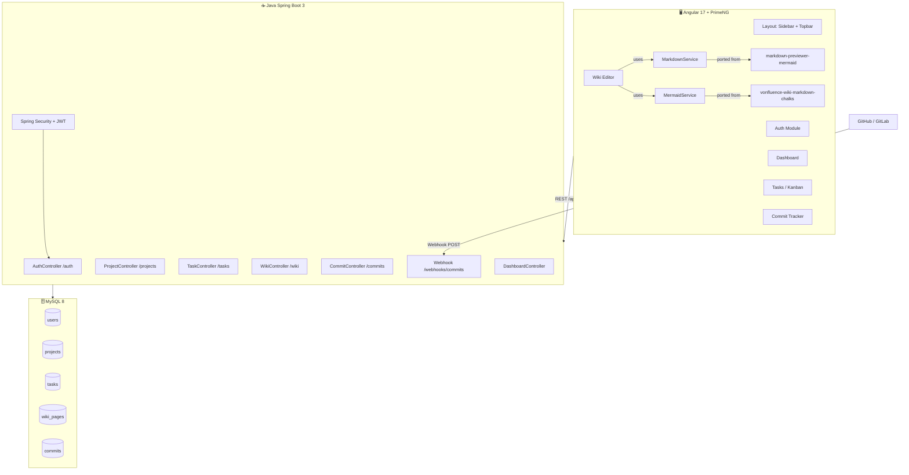

# MASTER PROMPT — Generate Full DevSync Application

> Use this single prompt with Claude, Cursor, or GitHub Copilot Chat to scaffold the 
> entire application at once. Reference the numbered prompt files for detailed per-module prompts.

---

## MASTER GENERATION PROMPT

```
You are a senior full-stack engineer. Build the complete "DevSync" project management application.

=== REPOSITORIES ===
Main repo:          https://github.com/sumitmali411-cyber/Project-management-application
Wiki sub-repo:      https://github.com/sumitmali411-cyber/vonfluence-wiki-markdown-chalks
Markdown sub-repo:  https://github.com/sumitmali411-cyber/markdown-previewer-mermaid
Design ref:         https://task-commit-hub--sumitmali411.replit.app (DevSync Unified Tracker)
Design ref 2:       https://stitch.withgoogle.com/projects/17911734835537799651

=== TECH STACK (MANDATORY - DO NOT DEVIATE) ===
Frontend:  Angular 17 standalone components, PrimeNG 17, PrimeFlex, npm
Backend:   Java 21, Spring Boot 3.2, Maven, Spring Security 6, JWT
Database:  MySQL 8, Flyway migrations
ORM:       Spring Data JPA / Hibernate with Lombok

=== PULL AND INTEGRATE THESE REPOS ===
1. git clone https://github.com/sumitmali411-cyber/vonfluence-wiki-markdown-chalks
   Port: confluenceParser.js → Angular ConfluenceParserService
   Port: mermaidLoader.js → Angular MermaidService  
   Port: styles.css → wiki.component.scss wiki panel styles
   Port: index.html structure → WikiEditorComponent template

2. git clone https://github.com/sumitmali411-cyber/markdown-previewer-mermaid
   Port: app.js → Angular MarkdownService (marked + DOMPurify pipeline)
   Port: mermaidLoader.js → merge into shared MermaidService (same service as above)
   Port: exportService.js → WikiExportService (PDF/DOCX export)
   Port: export_pdf.py → keep as standalone script in /scripts/export_pdf.py

=== DATABASE ===
MySQL 8. Run Flyway migration V1__initial_schema.sql (see 02-DATABASE-SCHEMA.md).
Tables: users, projects, project_members, sprints, tasks, task_tags, tags,
        task_comments, task_attachments, wiki_pages, wiki_page_versions,
        commits, notifications, activity_log

=== BACKEND STRUCTURE ===
Package: com.devapp
REST base: /api/v1
All responses: ApiResponse<T> { success, data, message, timestamp }
Entities: extend BaseEntity (id, createdAt, updatedAt, isDeleted)
Use @Where(clause="is_deleted=0") for soft deletes
Security: stateless JWT, BCrypt passwords
CORS: allow http://localhost:4200

Controllers:
- AuthController:         /auth/register, /auth/login, /auth/refresh
- ProjectController:      /projects CRUD + /projects/{id}/members
- TaskController:         /projects/{pid}/tasks CRUD + /kanban + PATCH status
- SprintController:       /projects/{pid}/sprints CRUD + /start + /close  
- WikiController:         /projects/{pid}/wiki CRUD + versioning
- CommitController:       /projects/{pid}/commits + /webhooks/commits (no auth)
- NotificationController: /notifications GET+PATCH
- DashboardController:    /dashboard/stats + /dashboard/burndown + /dashboard/activity
- SearchController:       /search?q=&type=

=== FRONTEND STRUCTURE ===
Lazy-loaded routes: /dashboard, /projects, /tasks, /wiki, /commits, /team, /settings
Auth routes: /auth/login, /auth/register (separate layout, no sidebar)

Core services:
- AuthService (signals: isAuthenticated, currentUser, token)
- authInterceptor (inject Bearer token)
- errorInterceptor (handle 401/403)

Modules:
1. Dashboard  — stats cards, burndown chart (PrimeNG Chart.js), activity timeline, my tasks
2. Projects   — list/grid view, create project dialog, project detail with tabs
3. Tasks      — Kanban board (CDK DragDrop) + List view, task detail sidebar, create dialog
4. Wiki       — tree sidebar (PrimeNG Tree) + split-pane editor (raw/preview) + viewer
               MUST support both Markdown (.md) AND Confluence wiki markup formats
               MUST render Mermaid diagrams with version switcher: 10.8, 11.2, 11.4, latest
5. Commits    — table with filters, link-to-task dialog, webhook setup instructions
6. Team       — members table, invite dialog, role management
7. Settings   — profile, notification prefs, API tokens display

=== WIKI MODULE SPECIFICS (from vonfluence-wiki-markdown-chalks) ===
The Wiki editor must support:
- Standard Markdown (via marked.js)
- Confluence wiki markup: headings (h1.-h6.), tables (||header||/|cell|), 
  lists (*,#), formatting (*bold*, _italic_, {{monospace}})
- Block macros: {info}...{info}, {tip}, {warning}, {note}, {panel:title=X}, {quote}
- {mermaid}...{/mermaid} blocks (render as Mermaid diagrams)
- DOMPurify sanitization on all rendered HTML
- Light/dark theme toggle
- Export to PDF (print dialog approach from markdown-previewer-mermaid)
- 120ms debounced live preview (exactly as in source repo)

=== DESIGN SYSTEM ===
PrimeNG theme: lara-dark-blue
Primary color: #4F46E5 (indigo)
Dark surfaces: #0f172a / #1e293b / #334155
Status colors: backlog=gray, todo=blue, in_progress=amber, in_review=purple, done=green
Priority: critical=red, high=amber, medium=blue, low=green

=== FOLDER STRUCTURE ===
/
├── frontend/         (Angular 17 app)
├── backend/          (Spring Boot 3 app)  
├── docs/wiki/        (Markdown docs in vonfluence format)
├── scripts/          (export_pdf.py from markdown-previewer-mermaid)
└── README.md

=== GENERATE IN THIS ORDER ===
1. MySQL Flyway migration SQL
2. Spring Boot entities + repositories + security
3. Spring Boot services + controllers + DTOs
4. Angular app.config.ts + app.routes.ts
5. Angular layout components (sidebar, topbar)
6. Angular auth module (login, register)
7. Angular shared services (auth, api, mermaid, markdown)
8. Angular dashboard module
9. Angular tasks/kanban module
10. Angular wiki module (with ported vonfluence + mermaid code)
11. Angular commits module
12. Angular styles.scss (dark theme)
13. Docker Compose for MySQL dev setup
14. README with all setup commands
```

---

## Quick Reference: All Install Commands

```bash
# ===== CLONE ALL REPOS =====
git clone https://github.com/sumitmali411-cyber/Project-management-application devapp
cd devapp
git clone https://github.com/sumitmali411-cyber/vonfluence-wiki-markdown-chalks temp/wiki
git clone https://github.com/sumitmali411-cyber/markdown-previewer-mermaid temp/mdprev

# ===== MYSQL VIA DOCKER =====
docker run -d --name devapp-mysql \
  -e MYSQL_ROOT_PASSWORD=root \
  -e MYSQL_DATABASE=devapp \
  -p 3306:3306 mysql:8.0

# ===== FRONTEND =====
ng new frontend --standalone --routing --style=scss --skip-git
cd frontend
npm install primeng@17 primeicons primeflex @angular/cdk
npm install marked@12 dompurify mermaid highlight.js
npm install @types/dompurify --save-dev

# ===== BACKEND =====
# Use Spring Initializr: https://start.spring.io
# Group: com.devapp, Artifact: backend, Java 21
# Dependencies: Spring Web, Data JPA, Security, MySQL Driver, Flyway, Lombok, Validation

# ===== RUN =====
cd frontend && npm start        # → http://localhost:4200
cd backend  && ./mvnw spring-boot:run  # → http://localhost:8080
```

---

## Mermaid Architecture Diagram


