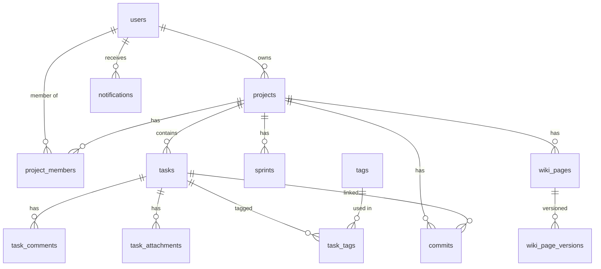

# 02 — Database Schema (MySQL)

## Prompt for AI Code Generation

```
Generate complete MySQL 8 Flyway migration scripts for the DevSync project management app.

SCHEMA REQUIREMENTS:
1. All tables use InnoDB, utf8mb4 charset
2. All PKs are BIGINT AUTO_INCREMENT
3. All tables have: created_at, updated_at (DATETIME DEFAULT CURRENT_TIMESTAMP)
4. Use soft deletes: is_deleted TINYINT(1) DEFAULT 0
5. Filename: V1__initial_schema.sql

TABLES NEEDED:
- users (id, username, email, password_hash, full_name, avatar_url, role, is_active)
- projects (id, name, slug, description, status, owner_id FK users, color, icon)
- project_members (id, project_id FK, user_id FK, role ENUM('ADMIN','PM','DEV','VIEWER'))
- tasks (id, project_id FK, title, description_md, status, priority, assignee_id FK users,
         reporter_id FK users, due_date, story_points, parent_task_id FK tasks, sprint_id FK)
- task_labels (id, task_id FK, label_name, color)
- task_comments (id, task_id FK, author_id FK users, content_md, is_edited)
- task_attachments (id, task_id FK, file_name, file_url, file_size, uploaded_by FK users)
- sprints (id, project_id FK, name, goal, start_date, end_date, status)
- wiki_pages (id, project_id FK, title, slug, content_md, content_html, author_id FK users,
              parent_page_id FK wiki_pages, sort_order)
- wiki_page_versions (id, wiki_page_id FK, content_md, version_number, edited_by FK users)
- commits (id, project_id FK, commit_hash, message, author_name, author_email,
           committed_at, repo_url, branch, linked_task_id FK tasks)
- notifications (id, user_id FK, title, message, type, is_read, entity_type, entity_id)
- activity_log (id, user_id FK, project_id FK, action, entity_type, entity_id, metadata JSON)
- tags (id, name, color, project_id FK)
- task_tags (task_id FK, tag_id FK, PRIMARY KEY composite)

OUTPUT: Single V1__initial_schema.sql file with all CREATE TABLE statements, indexes, and foreign keys.
```

---

## V1__initial_schema.sql

```sql
-- ============================================================
-- DevSync Project Management — Initial Schema
-- V1__initial_schema.sql
-- ============================================================

CREATE TABLE users (
    id              BIGINT AUTO_INCREMENT PRIMARY KEY,
    username        VARCHAR(50)  NOT NULL UNIQUE,
    email           VARCHAR(255) NOT NULL UNIQUE,
    password_hash   VARCHAR(255) NOT NULL,
    full_name       VARCHAR(100) NOT NULL,
    avatar_url      VARCHAR(500),
    role            ENUM('SUPER_ADMIN','USER') NOT NULL DEFAULT 'USER',
    is_active       TINYINT(1) NOT NULL DEFAULT 1,
    is_deleted      TINYINT(1) NOT NULL DEFAULT 0,
    created_at      DATETIME NOT NULL DEFAULT CURRENT_TIMESTAMP,
    updated_at      DATETIME NOT NULL DEFAULT CURRENT_TIMESTAMP ON UPDATE CURRENT_TIMESTAMP,
    INDEX idx_users_email (email),
    INDEX idx_users_username (username)
) ENGINE=InnoDB DEFAULT CHARSET=utf8mb4 COLLATE=utf8mb4_unicode_ci;


CREATE TABLE projects (
    id          BIGINT AUTO_INCREMENT PRIMARY KEY,
    name        VARCHAR(200) NOT NULL,
    slug        VARCHAR(200) NOT NULL UNIQUE,
    description TEXT,
    status      ENUM('ACTIVE','ARCHIVED','ON_HOLD') NOT NULL DEFAULT 'ACTIVE',
    owner_id    BIGINT NOT NULL,
    color       VARCHAR(7) DEFAULT '#4F46E5',
    icon        VARCHAR(50) DEFAULT 'pi pi-folder',
    is_deleted  TINYINT(1) NOT NULL DEFAULT 0,
    created_at  DATETIME NOT NULL DEFAULT CURRENT_TIMESTAMP,
    updated_at  DATETIME NOT NULL DEFAULT CURRENT_TIMESTAMP ON UPDATE CURRENT_TIMESTAMP,
    FOREIGN KEY (owner_id) REFERENCES users(id),
    INDEX idx_project_owner (owner_id),
    INDEX idx_project_status (status)
) ENGINE=InnoDB DEFAULT CHARSET=utf8mb4 COLLATE=utf8mb4_unicode_ci;


CREATE TABLE project_members (
    id          BIGINT AUTO_INCREMENT PRIMARY KEY,
    project_id  BIGINT NOT NULL,
    user_id     BIGINT NOT NULL,
    role        ENUM('ADMIN','PM','DEV','VIEWER') NOT NULL DEFAULT 'DEV',
    joined_at   DATETIME NOT NULL DEFAULT CURRENT_TIMESTAMP,
    FOREIGN KEY (project_id) REFERENCES projects(id) ON DELETE CASCADE,
    FOREIGN KEY (user_id) REFERENCES users(id) ON DELETE CASCADE,
    UNIQUE KEY uq_project_member (project_id, user_id)
) ENGINE=InnoDB DEFAULT CHARSET=utf8mb4 COLLATE=utf8mb4_unicode_ci;


CREATE TABLE sprints (
    id          BIGINT AUTO_INCREMENT PRIMARY KEY,
    project_id  BIGINT NOT NULL,
    name        VARCHAR(200) NOT NULL,
    goal        TEXT,
    start_date  DATE,
    end_date    DATE,
    status      ENUM('PLANNING','ACTIVE','COMPLETED','CANCELLED') NOT NULL DEFAULT 'PLANNING',
    is_deleted  TINYINT(1) NOT NULL DEFAULT 0,
    created_at  DATETIME NOT NULL DEFAULT CURRENT_TIMESTAMP,
    updated_at  DATETIME NOT NULL DEFAULT CURRENT_TIMESTAMP ON UPDATE CURRENT_TIMESTAMP,
    FOREIGN KEY (project_id) REFERENCES projects(id) ON DELETE CASCADE,
    INDEX idx_sprint_project (project_id)
) ENGINE=InnoDB DEFAULT CHARSET=utf8mb4 COLLATE=utf8mb4_unicode_ci;


CREATE TABLE tasks (
    id              BIGINT AUTO_INCREMENT PRIMARY KEY,
    project_id      BIGINT NOT NULL,
    sprint_id       BIGINT,
    parent_task_id  BIGINT,
    title           VARCHAR(500) NOT NULL,
    description_md  LONGTEXT,
    status          ENUM('BACKLOG','TODO','IN_PROGRESS','IN_REVIEW','DONE','CANCELLED') NOT NULL DEFAULT 'BACKLOG',
    priority        ENUM('CRITICAL','HIGH','MEDIUM','LOW','NONE') NOT NULL DEFAULT 'MEDIUM',
    task_type       ENUM('STORY','BUG','TASK','EPIC','SUBTASK') NOT NULL DEFAULT 'TASK',
    assignee_id     BIGINT,
    reporter_id     BIGINT,
    due_date        DATE,
    story_points    INT,
    sort_order      INT DEFAULT 0,
    is_deleted      TINYINT(1) NOT NULL DEFAULT 0,
    created_at      DATETIME NOT NULL DEFAULT CURRENT_TIMESTAMP,
    updated_at      DATETIME NOT NULL DEFAULT CURRENT_TIMESTAMP ON UPDATE CURRENT_TIMESTAMP,
    FOREIGN KEY (project_id) REFERENCES projects(id) ON DELETE CASCADE,
    FOREIGN KEY (sprint_id) REFERENCES sprints(id) ON SET NULL,
    FOREIGN KEY (parent_task_id) REFERENCES tasks(id) ON SET NULL,
    FOREIGN KEY (assignee_id) REFERENCES users(id) ON SET NULL,
    FOREIGN KEY (reporter_id) REFERENCES users(id) ON SET NULL,
    INDEX idx_task_project (project_id),
    INDEX idx_task_status (status),
    INDEX idx_task_assignee (assignee_id),
    INDEX idx_task_sprint (sprint_id)
) ENGINE=InnoDB DEFAULT CHARSET=utf8mb4 COLLATE=utf8mb4_unicode_ci;


CREATE TABLE tags (
    id          BIGINT AUTO_INCREMENT PRIMARY KEY,
    name        VARCHAR(50) NOT NULL,
    color       VARCHAR(7) DEFAULT '#6B7280',
    project_id  BIGINT NOT NULL,
    FOREIGN KEY (project_id) REFERENCES projects(id) ON DELETE CASCADE,
    UNIQUE KEY uq_tag_project (name, project_id)
) ENGINE=InnoDB DEFAULT CHARSET=utf8mb4 COLLATE=utf8mb4_unicode_ci;


CREATE TABLE task_tags (
    task_id BIGINT NOT NULL,
    tag_id  BIGINT NOT NULL,
    PRIMARY KEY (task_id, tag_id),
    FOREIGN KEY (task_id) REFERENCES tasks(id) ON DELETE CASCADE,
    FOREIGN KEY (tag_id) REFERENCES tags(id) ON DELETE CASCADE
) ENGINE=InnoDB DEFAULT CHARSET=utf8mb4 COLLATE=utf8mb4_unicode_ci;


CREATE TABLE task_comments (
    id          BIGINT AUTO_INCREMENT PRIMARY KEY,
    task_id     BIGINT NOT NULL,
    author_id   BIGINT NOT NULL,
    content_md  TEXT NOT NULL,
    is_edited   TINYINT(1) NOT NULL DEFAULT 0,
    is_deleted  TINYINT(1) NOT NULL DEFAULT 0,
    created_at  DATETIME NOT NULL DEFAULT CURRENT_TIMESTAMP,
    updated_at  DATETIME NOT NULL DEFAULT CURRENT_TIMESTAMP ON UPDATE CURRENT_TIMESTAMP,
    FOREIGN KEY (task_id) REFERENCES tasks(id) ON DELETE CASCADE,
    FOREIGN KEY (author_id) REFERENCES users(id),
    INDEX idx_comment_task (task_id)
) ENGINE=InnoDB DEFAULT CHARSET=utf8mb4 COLLATE=utf8mb4_unicode_ci;


CREATE TABLE task_attachments (
    id              BIGINT AUTO_INCREMENT PRIMARY KEY,
    task_id         BIGINT NOT NULL,
    file_name       VARCHAR(255) NOT NULL,
    file_url        VARCHAR(1000) NOT NULL,
    file_size       BIGINT,
    mime_type       VARCHAR(100),
    uploaded_by     BIGINT NOT NULL,
    created_at      DATETIME NOT NULL DEFAULT CURRENT_TIMESTAMP,
    FOREIGN KEY (task_id) REFERENCES tasks(id) ON DELETE CASCADE,
    FOREIGN KEY (uploaded_by) REFERENCES users(id)
) ENGINE=InnoDB DEFAULT CHARSET=utf8mb4 COLLATE=utf8mb4_unicode_ci;


CREATE TABLE wiki_pages (
    id              BIGINT AUTO_INCREMENT PRIMARY KEY,
    project_id      BIGINT NOT NULL,
    parent_page_id  BIGINT,
    title           VARCHAR(500) NOT NULL,
    slug            VARCHAR(500) NOT NULL,
    content_md      LONGTEXT,
    content_html    LONGTEXT,
    author_id       BIGINT NOT NULL,
    sort_order      INT DEFAULT 0,
    is_deleted      TINYINT(1) NOT NULL DEFAULT 0,
    created_at      DATETIME NOT NULL DEFAULT CURRENT_TIMESTAMP,
    updated_at      DATETIME NOT NULL DEFAULT CURRENT_TIMESTAMP ON UPDATE CURRENT_TIMESTAMP,
    FOREIGN KEY (project_id) REFERENCES projects(id) ON DELETE CASCADE,
    FOREIGN KEY (parent_page_id) REFERENCES wiki_pages(id) ON SET NULL,
    FOREIGN KEY (author_id) REFERENCES users(id),
    UNIQUE KEY uq_wiki_slug (project_id, slug),
    INDEX idx_wiki_project (project_id)
) ENGINE=InnoDB DEFAULT CHARSET=utf8mb4 COLLATE=utf8mb4_unicode_ci;


CREATE TABLE wiki_page_versions (
    id              BIGINT AUTO_INCREMENT PRIMARY KEY,
    wiki_page_id    BIGINT NOT NULL,
    content_md      LONGTEXT,
    version_number  INT NOT NULL,
    edited_by       BIGINT NOT NULL,
    created_at      DATETIME NOT NULL DEFAULT CURRENT_TIMESTAMP,
    FOREIGN KEY (wiki_page_id) REFERENCES wiki_pages(id) ON DELETE CASCADE,
    FOREIGN KEY (edited_by) REFERENCES users(id)
) ENGINE=InnoDB DEFAULT CHARSET=utf8mb4 COLLATE=utf8mb4_unicode_ci;


CREATE TABLE commits (
    id              BIGINT AUTO_INCREMENT PRIMARY KEY,
    project_id      BIGINT NOT NULL,
    linked_task_id  BIGINT,
    commit_hash     VARCHAR(40) NOT NULL,
    message         TEXT NOT NULL,
    author_name     VARCHAR(200),
    author_email    VARCHAR(255),
    committed_at    DATETIME,
    repo_url        VARCHAR(1000),
    branch          VARCHAR(200),
    is_deleted      TINYINT(1) NOT NULL DEFAULT 0,
    created_at      DATETIME NOT NULL DEFAULT CURRENT_TIMESTAMP,
    FOREIGN KEY (project_id) REFERENCES projects(id) ON DELETE CASCADE,
    FOREIGN KEY (linked_task_id) REFERENCES tasks(id) ON SET NULL,
    INDEX idx_commit_project (project_id),
    INDEX idx_commit_task (linked_task_id),
    INDEX idx_commit_hash (commit_hash)
) ENGINE=InnoDB DEFAULT CHARSET=utf8mb4 COLLATE=utf8mb4_unicode_ci;


CREATE TABLE notifications (
    id          BIGINT AUTO_INCREMENT PRIMARY KEY,
    user_id     BIGINT NOT NULL,
    title       VARCHAR(500) NOT NULL,
    message     TEXT,
    type        ENUM('TASK_ASSIGNED','TASK_UPDATED','COMMENT','MENTION','COMMIT','WIKI') NOT NULL,
    is_read     TINYINT(1) NOT NULL DEFAULT 0,
    entity_type VARCHAR(50),
    entity_id   BIGINT,
    created_at  DATETIME NOT NULL DEFAULT CURRENT_TIMESTAMP,
    FOREIGN KEY (user_id) REFERENCES users(id) ON DELETE CASCADE,
    INDEX idx_notif_user (user_id),
    INDEX idx_notif_read (user_id, is_read)
) ENGINE=InnoDB DEFAULT CHARSET=utf8mb4 COLLATE=utf8mb4_unicode_ci;


CREATE TABLE activity_log (
    id          BIGINT AUTO_INCREMENT PRIMARY KEY,
    user_id     BIGINT,
    project_id  BIGINT,
    action      VARCHAR(100) NOT NULL,
    entity_type VARCHAR(50),
    entity_id   BIGINT,
    metadata    JSON,
    created_at  DATETIME NOT NULL DEFAULT CURRENT_TIMESTAMP,
    INDEX idx_activity_project (project_id),
    INDEX idx_activity_user (user_id)
) ENGINE=InnoDB DEFAULT CHARSET=utf8mb4 COLLATE=utf8mb4_unicode_ci;
```

---

## Mermaid ER Diagram


